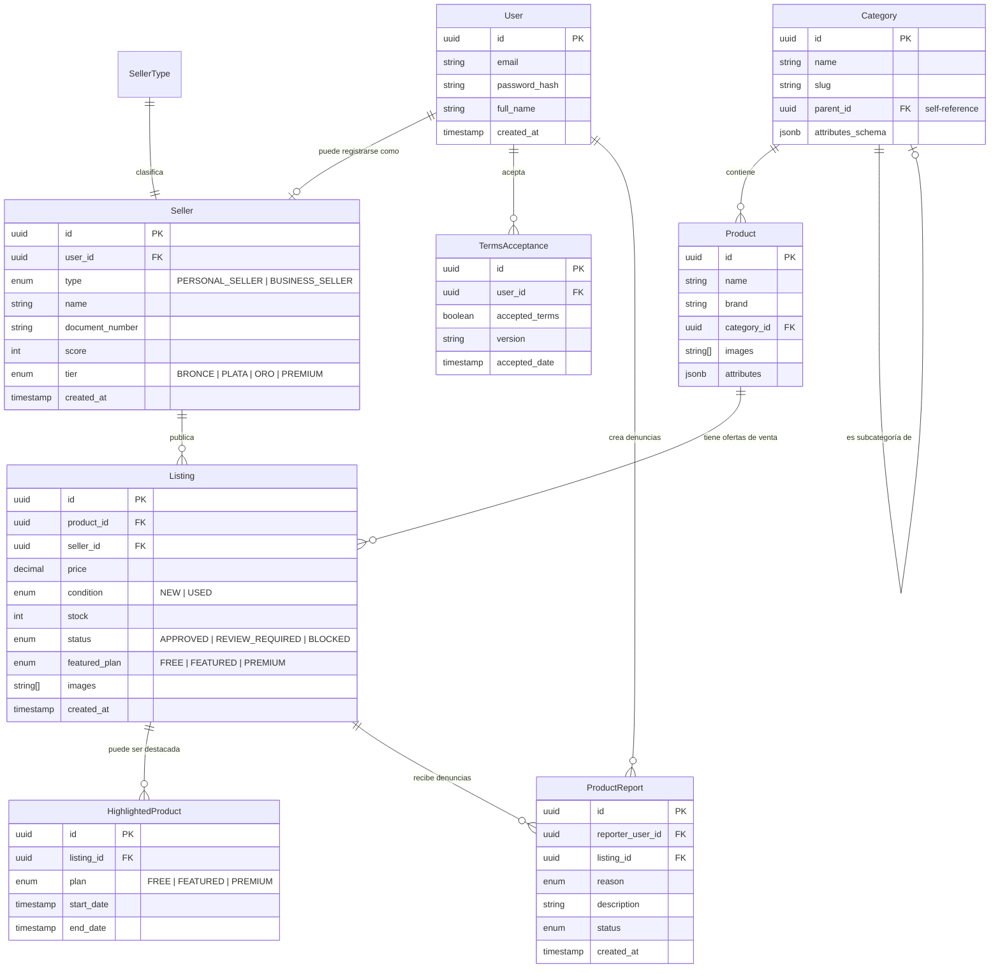

# Diseño Técnico: Modelo ER y Arquitectura de Software

Este documento define la arquitectura interna y el esquema de base de datos física para compraventaonline.com.ar.

---

## 1. Diseño de Base de Datos: Modelo Entidad-Relación (ER)

Utilizaremos **Prisma ORM** como herramienta de modelado y migraciones. El esquema físico define los tipos y relaciones clave.

### Diagrama ER (Mermaid)



---

## 2. Arquitectura Backend (NestJS Monolith Modular)

El backend de NestJS se estructurará de forma **modular**. Cada dominio de negocio encapsulará sus controladores, servicios, DTOs y persistencia en una arquitectura de 3 capas.

### Estructura de Carpetas Sugerida

```
backend/
├── src/
│   ├── app.module.ts
│   ├── prisma/
│   │   └── prisma.service.ts
│   ├── common/
│   │   ├── guards/
│   │   │   ├── auth.guard.ts
│   │   │   └── roles.guard.ts
│   │   └── filters/
│   │       └── http-exception.filter.ts
│   ├── modules/
│   │   ├── sellers/
│   │   │   ├── sellers.controller.ts
│   │   │   ├── sellers.service.ts
│   │   │   └── dto/
│   │   │       └── create-seller.dto.ts
│   │   ├── catalog/
│   │   │   ├── products.controller.ts
│   │   │   ├── products.service.ts
│   │   │   └── dto/
│   │   │       └── create-product.dto.ts
│   │   ├── listings/
│   │   │   ├── listings.controller.ts
│   │   │   ├── listings.service.ts
│   │   │   └── dto/
│   │   │       └── create-listing.dto.ts
│   │   ├── moderation/
│   │   │   ├── moderation.service.ts
│   │   │   └── moderation.processor.ts
│   │   └── reputation/
│   │       └── reputation.service.ts
```

---

## 3. Arquitectura Frontend (Next.js & Atomic Design)

El frontend de Next.js se estructurará siguiendo los principios de **Atomic Design** y **Mobile First**.

```
frontend/
├── src/
│   ├── app/                    # App Router (páginas y ruteo SSR)
│   │   ├── page.tsx            # Landing Page del Marketplace
│   │   ├── listing/[id]/       # Detalle de Publicación (SSR/ISR)
│   │   ├── search/             # Página de Búsqueda con filtros (Client Side)
│   │   ├── dashboard/          # Panel del Vendedor (B2C/C2C - Protegido)
│   │   └── layout.tsx
│   ├── components/             # Atomic Design
│   │   ├── atoms/              # Botones, inputs, badges, spinners
│   │   ├── molecules/          # Tarjeta de producto, barra de búsqueda, campos con validación
│   │   ├── organisms/          # Grilla de publicaciones, formulario de alta de publicación, header, footer
│   │   └── templates/          # Diseños de página base
│   ├── hooks/                  # Custom hooks (TanStack Query)
│   ├── store/                  # Zustand (estado global del cliente: carrito, sesión)
│   └── styles/
│       └── globals.css
```

---

## Próximo Paso
El siguiente documento es la planificación de tareas (`openspec/04-tasks.md`), donde desglosaremos la inicialización del monorepo y la estructura básica del código para comenzar a programar.
